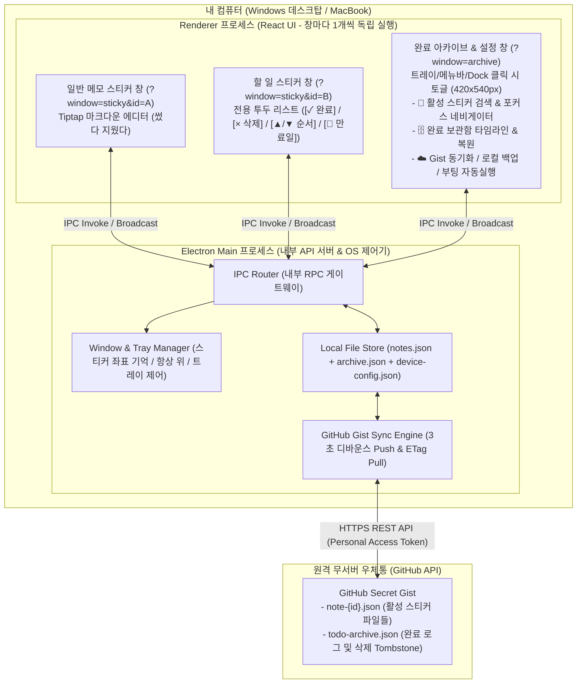

# 🏗️ 시스템 아키텍처 및 기술 스택 명세서

## 1. 아키텍처 개요 (Electron 프로세스 모델)

본 애플리케이션은 웹·백엔드 구조와 동일하게 **단일 로컬 서버(Electron Main 프로세스)**와 **다중 브라우저 클라이언트(Renderer 프로세스)** 구조로 동작합니다.

| 웹/서버 아키텍처 개념 | Electron 대응 개념 | 본 프로젝트에서의 역할 |
| :--- | :--- | :--- |
| **백엔드 API 서버** (예: FastAPI) | **Main 프로세스** (Node.js) | 앱 전체에 단 1개만 실행. 로컬 파일(`notes.json`, `archive.json`, `device-config.json`) 읽기/쓰기, GitHub Gist API 통신, 멀티 스티커 창 좌표/항상 위 제어, 시스템 트레이 담당 |
| **프론트엔드 클라이언트** | **Renderer 프로세스** (Chromium + React) | 각 스티커 창마다 1개씩 독립 실행 + 트레이의 '완료 아카이브 & 설정' 창 1개. UI 렌더링과 사용자 입력 처리만 수행 |
| **REST API 요청/응답** | **`ipcRenderer.invoke` ↔ `ipcMain.handle`** | Renderer가 Main 프로세스에 데이터 수정 및 창 제어를 비동기로 요청하고 응답을 받는 내부 RPC |
| **WebSocket / SSE 브로드캐스트** | **`webContents.send` ↔ `ipcRenderer.on`** | 스티커 수정 또는 원격 Pull 완료 시 모든 열린 창에 최신 상태를 즉시 푸시 |



---

## 2. 기술 스택 선정 및 대안 비교

### 2.1 데스크탑 프레임워크 비교
| 후보 기술 | 장점 | 한계 / 단점 | 채택 여부 |
| :--- | :--- | :--- | :---: |
| **Electron** | - 웹 프론트엔드(React/TS/Tailwind) 100% 활용<br/>- Windows/macOS 프레임리스 다중 창, Always-on-Top, 시스템 트레이 제어 안정성 최고<br/>- GitHub Actions 크로스 빌드 용이 | - Chromium 내장으로 설치 용량(~80MB)이 다소 큼 | ✅ **채택** |
| **Tauri** | - 설치 용량이 작고 가벼움 | - 백엔드(다중 창 관리, 파일/동기화)를 Rust로 작성해야 하며, OS별 WebView 엔진 차이 존재 | ❌ 제외 |
| **순수 웹앱 / PWA** | - 별도 설치 불필요 | - 브라우저 샌드박스로 인해 바탕화면 위 프레임리스 포스트잇 고정(Always-on-Top) 불가 | ❌ 제외 |

### 2.2 세부 기술 스택 확정표
| 영역 | 확정 기술 | 선정 이유 |
| :--- | :--- | :--- |
| **코어 / 빌드** | **Electron 34 + `electron-vite`** | Main, Preload, Renderer 3개 영역을 단일 설정으로 번들링 및 HMR 지원 |
| **프론트엔드 UI** | **React 19 + TypeScript + Tailwind CSS** | URL 쿼리 파라미터(`?window=sticky&id=...` vs `?window=archive`)로 단일 React 앱에서 모든 창 렌더링 |
| **일반 메모 에디터** | **Tiptap (`StarterKit`)** | 일반 메모(`memo`) 창에서 `# 제목`, `**강조**`, `` `코드` ``, `- 목록`을 실시간 WYSIWYG으로 변환 |
| **아이콘** | **Lucide React** | 미니멀 벡터 아이콘 제공 |
| **패키징** | **`electron-builder`** | Windows용 `NSIS Installer (.exe)` 및 macOS용 `.dmg` 패키지 생성 |

---

## 3. 프로젝트 디렉토리 구조 (Directory Structure)

```text
memo_app/
├── docs/                          # 설계 및 명세 문서
│   ├── architecture.md            # 아키텍처 및 기술 스택 명세
│   ├── functional-spec.md         # 도메인별 기능정의서
│   └── data-and-api-spec.md       # 데이터 모델 및 IPC/REST API 명세
├── src/
│   ├── shared/                    # Main과 Renderer가 공유하는 타입 및 상수
│   │   └── types.ts               # Note, TodoItem, ArchivedTodoLog, IPC 계약 타입
│   ├── main/                      # Electron Main 프로세스 (Node.js 로컬 백엔드)
│   │   ├── index.ts               # 앱 진입점 및 라이프사이클 제어
│   │   ├── windowManager.ts       # 멀티 스티커 창 및 아카이브 미니 창 생성·좌표·접기 제어
│   │   ├── trayManager.ts         # 시스템 트레이 메뉴 및 전역 단축키 등록
│   │   ├── localStore.ts          # notes.json, archive.json, device-config.json Atomic I/O
│   │   ├── gistSyncEngine.ts      # GitHub Gist 3초 디바운스 Push, ETag Pull, 충돌 사본 생성
│   │   └── ipcHandlers.ts         # ipcMain.handle 라우터
│   ├── preload/                   # 보안 브릿지 (contextBridge)
│   │   └── index.ts               # window.api 노출
│   └── renderer/                  # React 프론트엔드
│       ├── index.html
│       └── src/
│           ├── App.tsx            # 쿼리 파라미터(?window=sticky | archive) 라우터
│           ├── windows/
│           │   ├── StickyWindow.tsx   # 프레임리스 스티커 창 (미니 툴바 + 3초 삭제 취소)
│           │   └── ArchiveWindow.tsx  # 완료 아카이브 타임라인 & GitHub 동기화 설정 창
│           └── components/
│               ├── MemoEditor.tsx     # Tiptap 마크다운 에디터 (일반 메모용)
│               └── TodoListEditor.tsx # 상단 고정 입력창 + 완료 아카이빙 투두 리스트 (할 일용)
├── electron.vite.config.ts
├── electron-builder.yml
├── package.json
└── tsconfig.json
```

---

## 4. 무서버(Serverless) 동기화 및 충돌 방지 메커니즘

1. **Local-First 즉시 저장**:
   - 모든 생성·수정·삭제·할 일 완료는 네트워크 상태와 무관하게 로컬 디스크(`notes.json`, `archive.json`)에 Atomic Write(임시 파일 기록 후 이름 변경)로 즉시 저장됩니다.
2. **기기별 창 좌표 격리 (`device-config.json`)**:
   - 모니터 해상도가 다른 데스크탑과 맥북 간에 창이 화면 밖으로 사라지는 현상을 막기 위해, 스티커 창의 좌표(`x, y`), 크기(`width, height`), 항상 위(`alwaysOnTop`), 접힘 여부(`isCollapsed`)는 Gist에 올리지 않고 각 기기 로컬에만 저장합니다.
3. **오프라인 동시 수정 충돌 보호 (`[충돌 백업]` 사본 생성)**:
   - 서로 다른 스티커는 `note-{uuid}.json`으로 파일이 분리되어 있어 충돌이 발생하지 않습니다.
   - 양쪽 기기가 모두 오프라인인 상태에서 **동일한 스티커 하나**를 동시에 수정한 경우, `updatedAt`이 최신인 본문을 원본에 채택하고 이전 수정본은 **`[충돌 백업 - 기기명]` 새 스티커로 자동 복제**하여 데이터 유실을 원천 방지합니다.
   - 완료 아카이브(`todo-archive.json`)는 고유 ID 기준 합집합(Union)으로 병합되어 오프라인 완료 내역이 유실 없이 합쳐집니다.
