# 🛠️ GitHub Gist 동기화 엔진 문제 해결 및 최적화 보고서 (Sync Troubleshooting)

본 문서는 서버리스(Serverless) 환경에서 **GitHub Secret Gist**를 단일 진실 공급원(Single Source of Truth)으로 삼아 윈도우(PC)와 맥(macOS) 간 실시간 양방향 동기화를 구현하는 과정에서 발생한 핵심 동기화 버그들과 그 근본 원인 분석, 해결 과정을 상세히 기록합니다.

---

## 1. 개요 및 관련 컴포넌트

* **관련 모듈**:
  * [`src/main/gistSyncEngine.ts`](file:///c:/workspaces/memo_app/src/main/gistSyncEngine.ts): Gist REST API 통신, ETag 관리, 충돌 해결 및 업로드/다운로드 오케스트레이션
  * [`src/main/localStore.ts`](file:///c:/workspaces/memo_app/src/main/localStore.ts): 로컬 JSON(`notes.json`, `archive.json`, `device-config.json`) 입출력 및 Tombstone 관리
  * [`src/main/windowManager.ts`](file:///c:/workspaces/memo_app/src/main/windowManager.ts): 창 라이프사이클 및 화면 렌더러에 실시간 변경사항 브로드캐스트

---

## 2. 해결된 핵심 이슈 목록

```mermaid
flowchart TD
    subgraph Issue1["이슈 1: Gist 422 Unprocessable Entity"]
        A1["로컬 삭제 Tombstone 존재"] --> B1["Gist에 없는 파일에 ': null' 전송"]
        B1 --> C1["GitHub API 422 에러 반환"]
        C1 --> D1["동기화 전체 영구 중단"]
        D1 --> E1["해결: knownRemoteFiles 캐싱 & 원격 실존 파일만 ': null' 전송"]
    end

    subgraph Issue2["이슈 2: 활성 메모의 지속적 원격 삭제"]
        A2["활성 메모 ID가 Tombstone에 동시 존재"] --> B2["Push 시 활성 메모를 Gist에서 삭제 요청"]
        B2 --> C2["로컬 메모가 원격으로 동기화되지 않음"]
        C2 --> E2["해결: Tombstone 자정(Self-healing) & isMissingFromRemote 강제 업로드"]
    end

    subgraph Issue3["이슈 3: 동시 수정 충돌 시 창 복제 분열"]
        A3["동일 메모 동시 수정"] --> B3["기존: '# [충돌 백업 - 기기명]' 새 창 복제"]
        B3 --> C3["화면에 스티커 창 무한 증식 및 관리 피로"]
        C3 --> E3["해결: 단일 창 인라인 병합 (메모 인라인 diff / 투두 합집합)"]
    end
```



---

### 이슈 1: GitHub Gist 422 Unprocessable Entity 에러로 인한 동기화 중단

#### 1. 현상
* 특정 시점 이후 양쪽 기기에서 어떤 수정을 하더라도 상대 기기에 전혀 반영되지 않음.
* 메인 프로세스 로그에 지속적으로 `Sync push failed: 422 Unprocessable Entity ("missing_field on files")` 에러가 기록되며 Push 파이프라인이 정지됨.

#### 2. 원인 분석
* **Tombstone 메커니즘**: 사용자가 스티커를 삭제하면 `deletedNoteIds[noteId] = timestamp` 형태로 묘비(Tombstone)를 남김.
* **Gist API 삭제 방식**: Gist REST API(`PATCH /gists/{gist_id}`)에서 파일을 삭제하려면 요청 본문에 `files: { "note-xyz.json": null }`을 전송해야 함.
* **GitHub API의 엄격한 사양**:
  * 일반적인 REST API와 달리, GitHub Gist는 **원격 Gist에 실존하지 않는 파일명에 대해 `{ "file.json": null }`을 전송하면 무시하거나 404를 내는 것이 아니라 `422 Unprocessable Entity` 에러를 던지며 요청 전체를 거부**함.
  * 기기 A에서 이미 삭제되어 Gist에서 제거된 파일인데, 기기 B의 로컬 `deletedNoteIds`에 남아있는 파일명을 계속 `: null`로 전송하면서 동기화가 영구적인 에러 루프에 빠짐.

#### 3. 해결 조치 (`src/main/gistSyncEngine.ts`)
* **원격 파일 목록 캐싱 (`knownRemoteFiles`)**:
  * Gist를 GET해올 때 원격에 실제로 존재하는 파일명 목록을 `Set<string>`으로 메모리에 유지.
* **유효 삭제 대상만 필터링**:
  * `filesPatch` 생성 시, `knownRemoteFiles.has(fileName)`인 경우에만 `: null`을 추가하도록 조건 부여.
  * 원격에 이미 존재하지 않는 파일의 Tombstone은 로컬에서도 즉시 안전하게 정리(`delete deletedNoteIds[id]`).

```typescript
// 수정 전: 로컬 Tombstone에 있으면 무조건 : null 전송 (422 발생 원인)
for (const id of Object.keys(tombstones)) {
  filesPatch[`note-${id}.json`] = null
}

// 수정 후: 원격 Gist에 실제로 존재하는 파일만 안전하게 삭제 요청
for (const id of Object.keys(tombstones)) {
  const fileName = `note-${id}.json`
  if (this.knownRemoteFiles.has(fileName)) {
    filesPatch[fileName] = null
  } else {
    // 원격에 이미 없으므로 로컬 묘비 정리
    delete tombstones[id]
    tombstonesModified = true
  }
}
```

---

### 이슈 2: 활성 스티커가 삭제 묘비(Tombstone)에 갇혀 지속 삭제되던 문제

#### 1. 현상
* 윈도우나 맥에서 새로운 메모를 작성하거나 수정을 해도 상대 기기에 전달되지 않고, 오히려 Gist 웹에서 확인했을 때 해당 메모 파일이 삭제되어 사라짐.

#### 2. 원인 분석
* 삭제 테스트 및 과거 동기화 과정에서 특정 스티커 ID가 `deletedNoteIds`에 등록되었으나, 로컬의 활성 스티커 목록(`notes`)에도 여전히 남아있는 **상태 모순(Inconsistency)** 발생.
* 엔진이 Push를 수행할 때마다 활성 메모로 업로드하기는커녕, "삭제 목록에 등록되어 있으니 지워야 한다"고 판단하여 Gist에서 해당 파일을 지속적으로 삭제(`: null`)함.

#### 3. 해결 조치 (`src/main/gistSyncEngine.ts`, `src/main/localStore.ts`)
* **Tombstone 자정(Self-healing) 로직 도입**:
  * 엔진 시작 시 및 매 동기화 실행 직전, 현재 로컬 `notes`에 실존하는 활성 스티커 ID는 `deletedNoteIds`에서 즉시 강제 삭제.
* **원격 누락 파일 강제 업로드 (`isMissingFromRemote`)**:
  * 로컬에는 살아있는 활성 스티커인데 원격 Gist 파일 목록에 해당 `note-{id}.json`이 없는 경우, 더티(`isDirty`) 여부와 무관하게 `isMissingFromRemote = true`로 마킹하여 즉시 Gist로 강제 업로드되도록 보장.

```typescript
// 활성 스티커와 묘비 간의 모순 자정(Self-healing)
for (const activeNote of localNotes) {
  if (archiveData.deletedNoteIds && archiveData.deletedNoteIds[activeNote.id]) {
    delete archiveData.deletedNoteIds[activeNote.id]
    tombstonesModified = true
  }
}

// 원격에 없는 활성 로컬 스티커 감지 및 즉시 푸시
const isMissingFromRemote = !this.knownRemoteFiles.has(fileName)
if (isDirty || isMissingFromRemote) {
  filesPatch[fileName] = { content: JSON.stringify(note, null, 2) }
}
```

---

### 이슈 3: 동시 수정 충돌 시 새 창 복제 분열 → 단일 창 인라인 병합

#### 1. 현상
* 양쪽 기기(Mac, Win)를 모두 켜둔 상태에서 동일한 스티커를 양쪽에서 다르게 수정했을 때, 기존 설계는 `# [충돌 백업 - 기기명]`이라는 제목으로 새로운 스티커 창을 복제하여 생성함.
* 결과적으로 바탕화면에 스티커 창이 2개, 3개로 계속 분열되어 사용자가 수동으로 내용을 확인하고 지워야 하는 큰 번거로움 발생.

#### 2. 원인 분석
* 분산 시스템에서 데이터 유실을 막기 위한 가장 단순한 방식이 "사본 생성(Fork)"이지만, 데스크톱 바탕화면 포스트잇 UI 환경에서는 화면 공간을 차지하고 시각적 혼란을 야기함.

#### 3. 해결 조치 (`FN-SYS-03` 개편)
새 창을 복제하지 않고 **기존 단일 창 내부에서 인라인(In-place)으로 안전하게 병합**하도록 아키텍처 개편:

1. **일반 메모 (`memo`)**:
   * 타임스탬프 기준 최신 수정본(LWW, Last-Write-Wins)을 기본 본문으로 채택.
   * 패배한 쪽의 수정 내용은 해당 메모 본문 하단에 구분선과 함께 인라인으로 보존하여 데이터 유실 원천 차단:
     ```markdown
     [최신 본문 내용...]
     
     ---
     [⚠️ MacBookPro 충돌 내용 (2026-10-01 16:30)]
     [패배한 쪽의 본문 내용...]
     ```
2. **할 일 목록 (`todo`)**:
   * 각 기기에서 추가/체크한 할 일 항목들을 고유 `id` 기준으로 **합집합(Union)** 병합.
   * 양쪽에서 작성한 항목이 모두 살아남아 하나의 창에 온전히 통합됨.
3. **초기 빈 스티커 자동 정리 (Pristine Note Cleanup)**:
   * 새 기기 설치 시 기본 생성되었던 내용 없는 초기 스티커는, 원격 Gist에서 기존 스티커를 받아올 때 화면을 어지럽히지 않도록 자동으로 닫고 정리.

---

### 이슈 4: 체감 동기화 지연 및 반응성 최적화

#### 1. 현상
* 한쪽에서 메모를 작성하거나 체크한 뒤 다른 기기를 보았을 때 즉각 반영되지 않고 멍때리는 느낌 발생.

#### 2. 원인 분석 및 튜닝
* **차등 디바운스(Differentiated Debounce)**:
  * 타이핑(텍스트 입력): 불필요한 API 호출을 방지하기 위해 **1.5초 디바운스** 적용.
  * 조작 액션(할 일 체크 완료, 삭제, 순서 변경, 색상 변경): 사용자가 결과를 기다리는 작업이므로 즉시 반영되도록 **300ms 초고속 업로드** 적용.
* **이벤트 기반 즉각 당겨오기 (Event-driven Pull)**:
  * 10초 주기 백그라운드 폴링 외에도, **스티커 창을 마우스로 클릭(포커스)하는 순간** 즉시 Gist ETag를 확인하여 최신 상태를 불러오도록 트리거 추가.
  * 창을 클릭하는 0.1초 사이에 상대 기기의 최신 변경사항이 즉각 눈앞에 렌더링됨.

---

## 3. 검증 결과 및 아키텍처 원칙 (Takeaways)

1. **외부 플랫폼 API의 예외 사양 엄격 준수**:
   * GitHub Gist REST API의 `files[key] = null` 동작 방식(존재하지 않는 파일 삭제 요청 시 422 반환)을 반영해, 반드시 원격 상태를 사전 검증(Pre-validation) 후 요청을 구성해야 함.
2. **상태 불변성(Invariance)과 자정 능력(Self-healing)**:
   * 로컬 상태(`notes`)와 메타 상태(`deletedNoteIds`)가 상호 배타적이어야 한다는 불변식을 코어 로직에서 상시 보장함으로써 좀비 데이터 발생을 원천 방지함.
3. **데스크톱 UX에 최적화된 충돌 해결**:
   * 다중 창 환경에서는 새 창 복제보다 단일 창 인라인 병합이 사용자 경험 측면에서 압도적으로 우수함.
