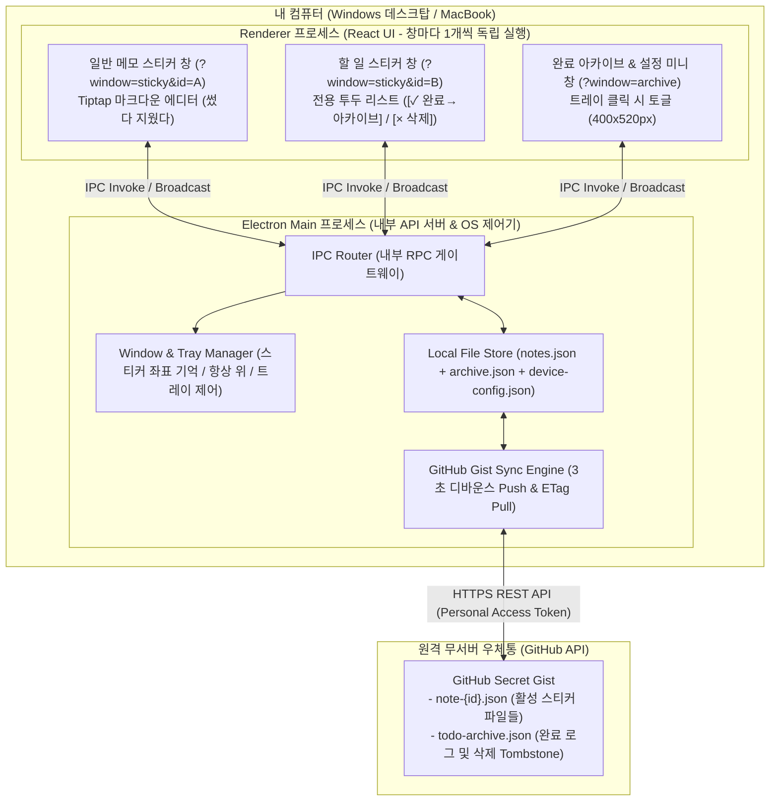

# 🗒️ 크로스플랫폼 하이브리드 메모 & 할 일 데스크탑 앱 설계서

메인 보드를 거칠 필요 없이 **바탕화면의 프레임리스 스티커 창들**이 곧 전체 작업 공간이 되는 100% 스티커 중심 데스크탑 앱 설계서입니다.
별도 백엔드 서버 없이 **GitHub 비공개 Gist API**를 원격 저장소로 활용하여 Windows와 macOS 간에 안전하게 Local-First로 동기화됩니다.

---

## 📌 확정된 핵심 설계 규격 요약 (Final Specifications)

| 구분 | 설계 규격 |
| :--- | :--- |
| **윈도우 구성** | **메인 보드 창 완전 제거**. 모든 활성 카드는 **바탕화면 스티커 창**으로만 존재 (최대 10개 제한). 보조 창으로 시스템 트레이에서 열리는 **'완료 아카이브 & 설정' 미니 창 (400×520px)** 단 1개만 사용 |
| **일반 메모 (`memo`)** | 자유 마크다운 에디터(`Tiptap`). 별도 제목칸 없이 첫 줄부터 바로 작성. 스크래치패드 성격으로 별도 완료/휴지통 없이 `🗑️` 클릭 시 3초 인라인 실행 취소 카운트다운 후 영구 삭제 |
| **할 일 (`todo`)** | 전용 투두 리스트 컴포넌트. 상단 그룹 제목란(기본값: `"할 일"`) + **상단 고정 새 할 일 입력창**(`Enter` 시 리스트 **맨 아래**에 순서대로 추가). 각 줄마다 **`[✓ 완료]`**(누르는 즉시 활성 리스트에서 사라지고 완료 시각과 함께 아카이브 로그에 영구 기록)와 **`[× 삭제]`**(로그 없이 단순 제거)로 명확히 분리 |
| **스티커 창 툴바 액션** | 상단 미니 툴바의 **`➕` 버튼은 현재 창과 동일한 타입(`memo`면 새 메모, `todo`면 새 할 일)으로 1클릭 즉시 생성**. `📌` 항상 위(Always on Top) 토글, `🎨` 4종 테마 색상 변경, `🗑️` 스티커 삭제 |
| **화면 공간 절약** | 스티커 상단 드래그 바 **더블클릭 시 높이 38px 미니 바로 접기/펼치기**.<br/>- `memo` 접힘 시: 본문 첫 줄 요약 텍스트 표시<br/>- `todo` 접힘 시: `그룹 제목 (남은 N건)` 표시 |
| **완료 아카이브 & 설정 창** | 시스템 트레이 아이콘 클릭 시 열림.<br/>- **탭 1 (완료 아카이브)**: 지금까지 완료한 모든 할 일을 **완료 날짜별(오늘, 어제, 일자별)** 타임라인으로 표시, `[↩️ 되돌리기]`(원래 스티커로 복귀) 및 `[🗑️ 기록 삭제]` 제공<br/>- **탭 2 (동기화 설정)**: GitHub PAT 토큰 등록, 연결된 Secret Gist ID 확인, 마지막 동기화 시각, '지금 동기화' 버튼 |
| **동기화 및 상태 격리** | • **Gist 동기화 대상**: 활성 스티커 본문 데이터(`note-{id}.json`) 및 완료 아카이브 로그(`todo-archive.json`)<br/>• **기기별 로컬 저장 대상 (`device-config.json`)**: 모니터 해상도 격리를 위해 창 좌표(`x, y`), 크기(`width, height`), 항상 위(`alwaysOnTop`), 접힘 여부(`isCollapsed`)는 기기별로 독립 기억 |
| **오프라인 충돌 해결** | 양쪽 기기에서 동일 스티커를 오프라인 동시 수정 시 최신본(`updatedAt`)을 원본에 유지하고, 다른 쪽 수정본은 **`[충돌 백업 - 기기명]` 새 스티커로 자동 복제** |
| **배포 패키징** | Windows: **NSIS 설치형 (`.exe`)** / macOS: **표준 디스크 이미지 (`.dmg`)** |

---

## 1. 기술 스택 및 Electron 프로세스 모델

백엔드·인프라 관점에서 Electron의 단일 메인 프로세스와 다중 렌더러 프로세스 구조로 완벽히 매핑됩니다.



### 1.1 기술 스택 확정표
| 영역 | 확정 기술 | 선정 이유 |
| :--- | :--- | :--- |
| **앱 쉘 / 코어** | **Electron 34 + `electron-vite`** | 프레임리스 창, Always on Top, 시스템 트레이 제어가 가장 성숙함. 단일 명령어 빌드 툴체인 |
| **UI 프레임워크** | **React 19 + TypeScript + Tailwind CSS** | 컴포넌트 재사용 및 쿼리 파라미터(`?window=sticky&id=...` vs `?window=archive`) 기반 단일 번들 라우팅 |
| **메모 에디터** | **Tiptap (StarterKit)** | 일반 메모 창에서 `# 제목`, `**강조**`, `` `코드` ``, `- 목록`을 타이핑과 동시에 서식으로 렌더링 |
| **아이콘** | **Lucide React** | 미니멀 벡터 아이콘 (`Pin`, `Palette`, `Plus`, `Trash2`, `Archive`, `Undo2` 등) |
| **패키징** | **`electron-builder`** | Windows용 `NSIS Installer .exe` 및 macOS용 `.dmg` 자동 빌드 |

---

## 2. 기능정의서 (Functional Specification)

### 2.1 스티커 노트 창 기능 (Sticky Window Domain)

| 기능 ID | 기능명 | 동작 규격 및 조건 분기 | 우선순위 |
| :--- | :--- | :--- | :---: |
| **FN-STK-01** | **프레임리스 창 및 상단 미니 툴바** | - OS 기본 타이틀바가 제거된 파스텔 포스트잇 스타일 디자인 적용<br/>- 창 상단 호버/포커스 시 미니 툴바 표시: `➕ 동일 타입 스티커 추가`, `🎨 색상 변경`, `📌 항상 위 토글`, `🗑️ 스티커 삭제`<br/>- 최대 활성 스티커 개수는 **10개**로 제한(10개 도달 시 `➕` 버튼 비활성화 및 안내 토스트 표시) | **P0** |
| **FN-STK-02** | **`➕` 동일 타입 스티커 1클릭 생성** | - 메모 스티커에서 `➕` 클릭 시: 새 일반 메모(`memo`) 스티커 창을 즉시 생성하여 우측 대각선(+24px, +24px) 위치에 띄우고 커서 포커스<br/>- 할 일 스티커에서 `➕` 클릭 시: 새 할 일(`todo`) 스티커 창을 즉시 생성 | **P0** |
| **FN-STK-03** | **`🗑️` 스티커 삭제 및 3초 실행 취소** | - 툴바 `🗑️` 클릭 시: 스티커 내부 영역이 `"삭제되었습니다 [↩️ 실행 취소] (3s)"` 오버레이로 전환됨<br/>- 3초 이내에 `[↩️ 실행 취소]`를 클릭하면 정상 상태로 복귀<br/>- 3초가 지나면 창이 닫히며 로컬 `notes.json`에서 완전히 영구 삭제(로그 남기지 않음)되고 Gist 파일 삭제 예약 | **P0** |
| **FN-STK-04** | **항상 위(Always-on-Top) 고정 토글** | - `📌` 버튼 클릭 시 `alwaysOnTop` 상태를 토글하며, Electron `setAlwaysOnTop(flag, 'floating')` 실행<br/>- 고정 상태는 해당 기기 로컬 설정(`device-config.json`)에 즉시 저장 | **P0** |
| **FN-STK-05** | **상단바 더블클릭 접기 (미니모드)** | - 상단 드래그 바를 더블클릭하면 높이 38px의 얇은 바 형태로 축소 (`isCollapsed = true`)<br/>  • `memo` 접힘 시: 본문 첫 번째 줄 텍스트를 헤더에 표시<br/>  • `todo` 접힘 시: `그룹 제목 (남은 N건)` 형태로 표시<br/>- 다시 더블클릭하면 원래 크기(`height`)로 즉시 복원 | **P0** |
| **FN-STK-06** | **창 좌표 및 크기 기기별 자동 기억** | - 스티커 창을 이동하거나 모서리를 드래그해 크기를 변경하면 디바운스(300ms) 후 `device-config.json`에 `x, y, width, height` 저장<br/>- 앱 재시작 시 저장된 좌표로 정확히 복원하며, 외부 모니터 분리로 인해 화면 밖으로 벗어난 좌표는 주 모니터 영역 내부로 자동 보정(Clamping) | **P0** |

### 2.2 에디터 & 투두 리스트 기능 (Editor Domain)

| 기능 ID | 기능명 | 동작 규격 및 조건 분기 | 우선순위 |
| :--- | :--- | :--- | :---: |
| **FN-EDT-01** | **📝 일반 메모: Tiptap 마크다운 에디터** | - 별도 제목칸 없이 첫 줄부터 자유롭게 타이핑 시작<br/>- `# ` 입력 시 제목 헤딩, `**텍스트**` 입력 시 굵게, `~~텍스트~~` 입력 시 취소선, `` `코드` `` 입력 시 인라인 코드, `- ` 입력 시 일반 글머리 기호 목록 자동 렌더링<br/>- 내용이 창 높이를 초과하면 내부 스크롤바 표시 | **P0** |
| **FN-EDT-02** | **☑️ 할 일: 상단 그룹 제목 및 상단 고정 입력창** | - 최상단: 그룹 제목 입력란 (기본 placeholder: `"할 일 제목..."`, 비어 있을 시 기본 그룹명 `"할 일"`로 취급)<br/>- 그룹 제목 바로 아래: **새 할 일 입력창 고정 배치** (할 일 타이핑 후 `Enter` 입력 시 리스트 **맨 아래에 순서대로 추가**되며 입력창은 즉시 공백으로 초기화)<br/>- 공백(스페이스만 입력된 경우 포함) 상태에서 `Enter` 입력 시 무시 | **P0** |
| **FN-EDT-03** | **☑️ 할 일: `[✓ 완료]` (아카이빙) vs `[× 삭제]`** | - **`[✓ 완료]` 버튼 클릭**: 클릭 즉시 0.2초 체크 페이드아웃 애니메이션 후 활성 리스트에서 영구 제거되며, `completedAt = Date.now()` 타임스탬프와 함께 **완료 아카이브(`archive.json`)에 즉시 추가**<br/>- 완료 직후 스티커 하단에 3초간 `[완료되었습니다 | 실행 취소]` 미니 토스트 표시<br/>- **`[× 삭제]` 버튼 클릭**: 잘못 작성한 항목이므로 아카이브에 남기지 않고 즉시 영구 제거 | **P0** |
| **FN-EDT-04** | **4종 테마 컬러 팔레트** | - 노란색(`yellow`), 민트(`mint`), 핑크(`pink`), 퍼플(`purple`)<br/>- 색상 변경 시 모든 열려 있는 창과 Gist 동기화 큐에 즉시 반영 | **P0** |

### 2.3 완료 아카이브 & 설정 창 기능 (Archive & Settings Domain)

| 기능 ID | 기능명 | 동작 규격 및 조건 분기 | 우선순위 |
| :--- | :--- | :--- | :---: |
| **FN-ARC-01** | **트레이 기반 미니 창 오픈** | - 시스템 트레이 아이콘 좌클릭 시 트레이 위치 근처에 400×520px 크기의 '완료 아카이브 & 설정' 창 토글<br/>- 상단 탭: **`[🗄️ 완료 아카이브]`** / **`[⚙️ 동기화 설정]`** 2개 탭으로 구성 | **P0** |
| **FN-ARC-02** | **완료 아카이브 일자별 타임라인 뷰** | - 지금까지 완료한 모든 할 일을 완료 일자 기준으로 그룹핑하여 역순(최신 일자가 맨 위) 표시: `오늘 (N건)`, `어제 (N건)`, `YYYY년 MM월 DD일 (N건)`<br/>- 각 항목: `[완료 시각 HH:mm] [소속 그룹 배지] 할 일 내용`<br/>- 상단 키워드 검색창으로 완료된 지난 작업 내용 실시간 필터링 | **P0** |
| **FN-ARC-03** | **완료 취소 (되돌리기) 및 기록 삭제** | - **`[↩️ 되돌리기]` 클릭 시**: 아카이브에서 해당 로그를 제거하고, 원래 속해 있던 활성 할 일 스티커(`sourceNoteId`)의 리스트 맨 아래로 복원.<br/>  *(단, 원래 스티커가 이미 삭제된 경우: 동일한 그룹명과 색상을 가진 새 할 일 스티커 창을 자동 생성하여 그 안에 복원)*<br/>- **`[🗑️ 기록 삭제]` 클릭 시**: 해당 완료 로그를 아카이브에서 영구 삭제 | **P0** |
| **FN-ARC-04** | **GitHub Gist 무서버 동기화 설정** | - Personal Access Token(`gist` 권한) 입력 및 [연결] 버튼 클릭<br/>- 유효성 검증 성공 시: 기존 `[HybridMemoApp] Sync Store` 비공개 Gist가 있으면 자동 연결하고, 없으면 새로 생성하여 첫 동기화 즉시 실행<br/>- 화면에 연결된 Gist ID, 마지막 동기화 일시, `[🔄 지금 동기화]` 버튼 제공 | **P0** |

### 2.4 시스템 라이프사이클 및 동기화 기능 (System Domain)

| 기능 ID | 기능명 | 동작 규격 및 조건 분기 | 우선순위 |
| :--- | :--- | :--- | :---: |
| **FN-SYS-01** | **앱 부팅 & 트레이 상주 라이프사이클** | - **앱 실행 시**: `device-config.json`에 저장된 이전 스티커 창들을 바탕화면에 자동 복원. 저장된 스티커가 0개인 경우 기본 노란색 일반 메모 스티커 1개를 화면 중앙에 자동 생성<br/>- 트레이 우클릭 메뉴: `📝 새 메모 스티커`, `☑️ 새 할 일 스티커`, `👀 모든 스티커 숨기기/보이기`, `🗄️ 아카이브 & 설정 열기`, `🔄 지금 동기화`, `✖ 앱 완전 종료`<br/>- 전역 단축키: `Ctrl/Cmd + Shift + N` (새 메모), `Ctrl/Cmd + Shift + T` (새 할 일) | **P1** |
| **FN-SYS-02** | **3초 디바운스 Push & ETag Pull** | - **Push**: 스티커 내용 수정 또는 아카이빙 발생 후 **마지막 조작으로부터 3초간 추가 입력이 없으면** 변경된 파일만 Gist에 증분 `PATCH`<br/>- **Pull**: 앱 시작 시, 절전 모드 복귀(`resume`) 시, 60초 주기 타이머 도래 시 `If-None-Match: <ETag>`로 조회하여 변경 없으면 즉시 종료(`304`), 변경 시 로컬과 병합 | **P0** |
| **FN-SYS-03** | **오프라인 동시 수정 충돌 사본 생성** | - 내 기기에서도 수정되었고 원격 Gist에서도 수정된 동일 스티커가 발견된 경우: `updatedAt`이 최신인 데이터를 해당 스티커에 반영하고, 다른 쪽 수정본은 **`[충돌 백업 - 기기명]` 제목의 새 스티커 창으로 복제**하여 데이터 유실 100% 방지 | **P0** |

---

## 3. 데이터 모델 정의서 (Data Schema)

### 3.1 원격 동기화 모델 (GitHub Gist 파일 규격)

#### ① 개별 활성 스티커 파일 (`note-{uuid}.json`)
```typescript
export type NoteType = 'memo' | 'todo';
export type NoteColor = 'yellow' | 'mint' | 'pink' | 'purple';

export interface TodoItem {
  id: string;               // 항목 고유 UUID v4
  text: string;             // 할 일 내용
  createdAt: number;        // 항목 등록 시각 (Epoch ms)
}

export interface Note {
  id: string;               // 스티커 고유 UUID v4
  type: NoteType;           // 'memo' | 'todo'
  color: NoteColor;         // 4종 테마 컬러

  // type === 'memo' 일 때 사용 (type === 'todo'이면 빈 문자열 "")
  content: string;          // 마크다운 원문 텍스트

  // type === 'todo' 일 때 사용 (type === 'memo'이면 빈 문자열 및 빈 배열)
  groupTitle: string;       // 할 일 그룹 제목 (예: "오늘 할 일")
  todos: TodoItem[];        // 현재 진행 중인 미완료 항목 목록

  createdAt: number;        // 최초 생성 시각 (Epoch ms)
  updatedAt: number;        // 최종 수정 시각 (Epoch ms)
  lastDeviceName: string;   // 최종 수정한 기기 이름 (예: "Home-PC", "MacBook-Pro")
}
```

#### ② 완료 아카이브 & 동기화 메타 파일 (`todo-archive.json`)
```typescript
export interface ArchivedTodoLog {
  id: string;               // TodoItem.id
  text: string;             // 할 일 내용
  sourceNoteId: string;     // 완료 당시 속해 있던 스티커 ID
  sourceGroupTitle: string; // 완료 당시 그룹 제목 (예: "업무")
  color: NoteColor;         // 완료 당시 스티커 배경색
  createdAt: number;        // 할 일 등록 시각
  completedAt: number;      // 완료 클릭 시각 (Epoch ms — 타임라인 정렬 기준)
  completedByDevice: string;// 완료 처리한 기기 이름
}

export interface GistArchivePayload {
  archivedLogs: ArchivedTodoLog[];
  deletedNoteIds: Record<string, number>; // { [noteId]: deletedAtMs } 기기 간 삭제 전파용
  deletedLogIds: Record<string, number>;  // { [logId]: deletedAtMs } 아카이브 영구삭제 전파용
}
```

### 3.2 기기 전용 로컬 설정 모델 (`device-config.json`)
모니터 좌표계 차이로 인한 창 이탈을 방지하기 위해 로컬에만 저장됩니다.

```typescript
export interface StickyWindowState {
  x: number;
  y: number;
  width: number;            // 기본값: 300
  height: number;           // 기본값: 360
  alwaysOnTop: boolean;     // 기본값: false
  isCollapsed: boolean;     // 기본값: false (높이 38px 미니바 여부)
}

export interface NoteSyncMeta {
  baseUpdatedAt: number;    // 마지막 Gist 동기화 시점의 updatedAt (동시 수정 충돌 감지)
  isDirty: boolean;         // 로컬 수정 후 Gist 미반영 여부
}

export interface LocalDeviceConfig {
  deviceId: string;
  deviceName: string;       // os.hostname()
  encryptedGithubToken?: string; // safeStorage 암호화
  gistId?: string;
  lastSyncedAt?: number;
  lastEtag?: string;
  stickies: Record<string, StickyWindowState>; // Key: Note.id
  syncMeta: Record<string, NoteSyncMeta>;      // Key: Note.id
  isArchiveDirty: boolean;
}
```

---

## 4. API 명세서 (API Specification)

### 4.1 내부 IPC API (Renderer ↔ Main Process)

프론트엔드에서는 `window.api.notes.updateMemo(...)` 형식으로 호출합니다.

```typescript
export interface StickyViewModel extends Note {
  alwaysOnTop: boolean;
  isCollapsed: boolean;
}
```

#### A. 스티커 데이터 관리 API
| 채널명 (Endpoint) | 통신 방식 | Request Payload | Response | 상세 동작 규격 |
| :--- | :---: | :--- | :--- | :--- |
| `notes:getAllStickies` | Invoke | `void` | `StickyViewModel[]` | 로컬 전체 활성 스티커 목록 + 창 상태 반환 |
| `notes:getById` | Invoke | `{ id: string }` | `StickyViewModel \| null` | 스티커 창 최초 로드 시 해당 데이터 조회 |
| `notes:create` | Invoke | `{ type: 'memo' \| 'todo', color?: NoteColor }` | `StickyViewModel` | 새 스티커 생성 후 프레임리스 창 즉시 오픈 |
| `notes:updateMemo` | Invoke | `{ id: string, content?: string, color?: NoteColor }` | `StickyViewModel` | 일반 메모 본문/색상 수정 및 3초 디바운스 Push 예약 |
| `notes:updateTodoGroup`| Invoke | `{ id: string, groupTitle?: string, color?: NoteColor }`| `StickyViewModel` | 할 일 그룹명/색상 수정 |
| `notes:addTodoItem` | Invoke | `{ noteId: string, text: string }` | `StickyViewModel` | 상단 입력창에서 `Enter` 시 리스트 맨 아래에 추가 |
| `notes:editTodoItem` | Invoke | `{ noteId: string, itemId: string, text: string }` | `StickyViewModel` | 특정 항목 텍스트 인라인 수정 |
| `notes:completeTodoItem`| Invoke | `{ noteId: string, itemId: string }` | `{ note: StickyViewModel, archivedLog: ArchivedTodoLog }` | **항목을 활성 카드에서 제거하고 아카이브에 즉시 추가** 후 모든 창에 브로드캐스트 |
| `notes:deleteTodoItem` | Invoke | `{ noteId: string, itemId: string }` | `StickyViewModel` | 항목 단순 제거 (아카이브에 기록하지 않음) |
| `notes:deleteSticky` | Invoke | `{ id: string }` | `{ success: boolean }` | 스티커 창 닫기 및 파일 영구 삭제, Gist 삭제 예약 |
| **`notes:changed`** | **Broadcast** | `{ stickies: StickyViewModel[], archivedLogs: ArchivedTodoLog[] }` | *(단방향)* | 스티커 수정 또는 Pull 완료 시 모든 열린 창 동기화 |

#### B. 완료 아카이브 API
| 채널명 (Endpoint) | 통신 방식 | Request Payload | Response | 상세 동작 규격 |
| :--- | :---: | :--- | :--- | :--- |
| `archive:getAll` | Invoke | `void` | `ArchivedTodoLog[]` | 완료 시각(`completedAt`) 역순 정렬된 전체 로그 반환 |
| `archive:uncomplete` | Invoke | `{ logId: string }` | `{ stickies: StickyViewModel[], archivedLogs: ArchivedTodoLog[] }` | 아카이브에서 제거하고 원래 스티커(삭제되었으면 새 스티커 생성)로 복구 |
| `archive:deleteLog` | Invoke | `{ logId: string }` | `{ success: boolean }` | 특정 완료 기록 영구 삭제 |

#### C. 창 제어 & 동기화 설정 API
| 채널명 (Endpoint) | 통신 방식 | Request Payload | Response | 상세 동작 규격 |
| :--- | :---: | :--- | :--- | :--- |
| `window:openArchive` | Invoke | `void` | `{ success: boolean }` | '완료 아카이브 & 설정' 미니 창 오픈 또는 포커스 |
| `window:toggleAlwaysOnTop` | Invoke | `{ noteId: string }` | `{ alwaysOnTop: boolean }` | 해당 창 Always-on-Top 토글 및 로컬 저장 |
| `window:toggleCollapse` | Invoke | `{ noteId: string }` | `{ isCollapsed: boolean }` | 상단바 더블클릭 시 38px 미니바 토글 |
| `window:toggleHideAll` | Invoke | `void` | `{ isHidden: boolean }` | 트레이 메뉴용: 모든 스티커 일시 숨김/보이기 토글 |
| `sync:setupToken` | Invoke | `{ token: string }` | `{ success: boolean, gistId: string }` | PAT 검증, Gist 자동 탐색/생성 및 초기 동기화 |
| `sync:triggerNow` | Invoke | `void` | `{ status: SyncStatus, syncedCount: number }` | 즉시 수동 동기화 실행 |
| **`sync:statusChanged`** | **Broadcast** | `{ status: 'SYNCED' \| 'SYNCING' \| 'OFFLINE' \| 'ERROR', lastSyncedAt?: number }` | *(단방향)* | 동기화 상태 갱신 이벤트 |

---

### 4.2 외부 REST API (Main Process ↔ GitHub Gist)

- **인증**: `Authorization: Bearer <PAT>` (스코프: `gist` 1개만 요구)
- **동작 1 (탐색/생성)**: `GET /gists`로 `description === "[HybridMemoApp] Sync Store"` 탐색 후 없으면 `POST /gists`로 생성
- **동작 2 (Pull)**: `GET /gists/{gist_id}`에 `If-None-Match` 헤더 전송 (`304` 시 무동작, `200` 시 변경분 로컬 파일 갱신 및 충돌 감지)
- **동작 3 (Push)**: `PATCH /gists/{gist_id}`로 변경된 `note-{id}.json` 파일들과 `todo-archive.json`만 증분 전송 (삭제된 카드는 파일값 `null` 전송)

---

## 5. 단계별 개발 로드맵 (Phased Plan)

1. **Phase 1: 프로젝트 스캐폴딩 & 멀티 스티커·트레이 코어 구축**
   - `c:\workspaces\memo_app` 내 `electron-vite` (React + TS + Tailwind) 초기화
   - `WindowManager` 및 `TrayManager` 구현:
     - 시작 시 이전 스티커 자동 복원 (없으면 기본 메모 1개 생성)
     - 트레이 우클릭 메뉴 및 전역 단축키(`Ctrl/Cmd+Shift+N`, `Ctrl/Cmd+Shift+T`) 등록
     - 프레임리스 스티커 창 이동, 크기 조절, 더블클릭 접기(38px), Always on Top 구현
2. **Phase 2: 로컬 Store & IPC 브로드캐스트 파이프라인**
   - 로컬 파일 Atomic 쓰기 (`notes.json`, `archive.json`, `device-config.json`)
   - 메모 및 할 일 CRUD, `[✓ 완료]` 시 아카이브 이동 및 `[↩️ 되돌리기]` IPC 구현
3. **Phase 3: Tiptap 마크다운 & 투두 리스트 컴포넌트 완성**
   - 일반 메모 스티커 창: Tiptap 마크다운 에디터 탑재
   - 할 일 스티커 창: 상단 고정 입력창 + `[✓ 완료]` 애니메이션 + `[× 삭제]` 투두 컴포넌트 탑재
   - 툴바 3초 실행 취소 카운트다운 삭제 UX 구현
4. **Phase 4: '완료 아카이브 & 설정' 미니 창 (400×520px) 구현**
   - 일자별 완료 로그 타임라인 뷰, 검색, 되돌리기, 영구 삭제 구현
   - GitHub PAT 설정 및 Secret Gist 자동 연결 UI 구현
5. **Phase 5: GitHub Gist 무서버 동기화 엔진 & 빌드 패키징**
   - 3초 디바운스 Push, ETag Pull, 충돌 백업 사본 생성기 구현
   - Windows `NSIS .exe` 및 macOS `.dmg` 빌드 설정 완료 및 `docs/` 문서 분리 정리
